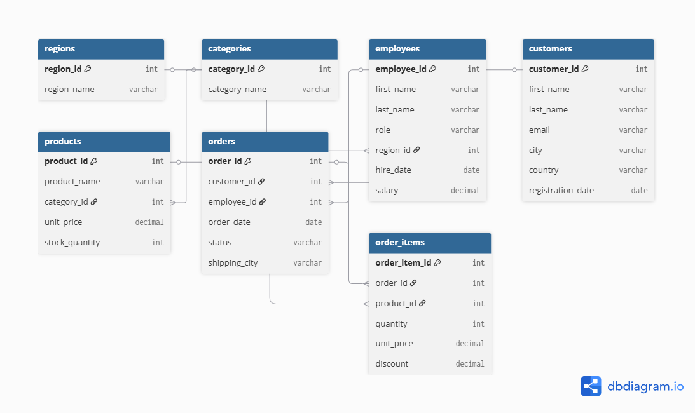
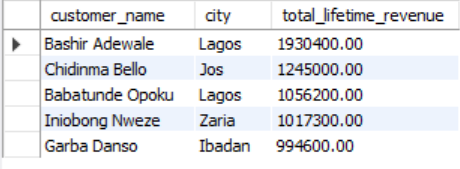
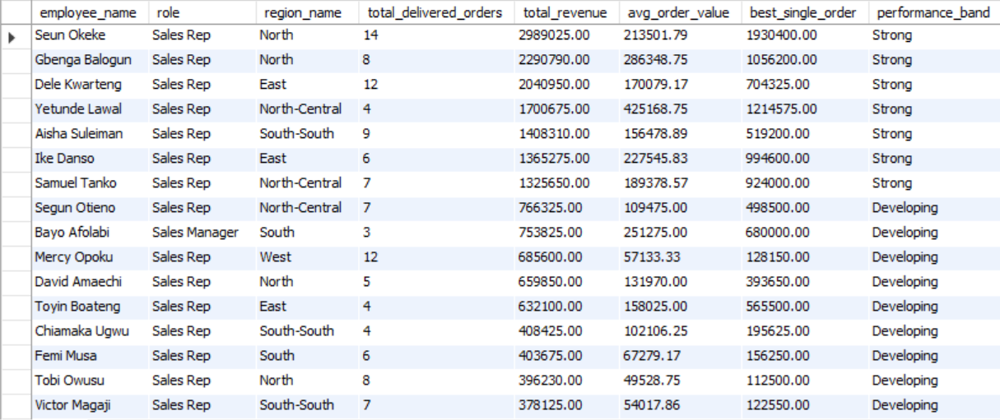
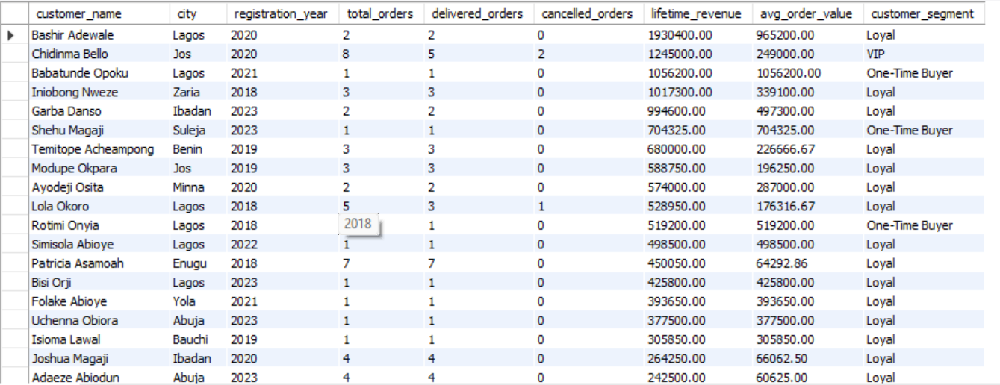
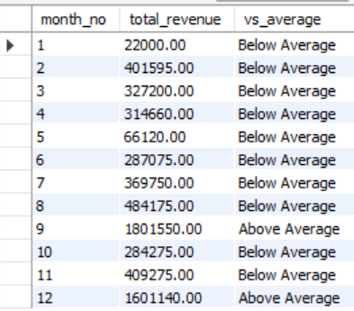

# SuperMart Analytics Project (PostgreSQL)

## Project Overview

This project is a comprehensive SQL analytics case study built using PostgreSQL. The objective is to analyze sales, customers, employees, products, and business performance data for a fictional retail company, **SuperMart**.

The project demonstrates fundamental and intermediate SQL skills including:

* Data filtering and sorting
* Aggregate functions
* Grouping and summarization
* Pattern matching with LIKE and ILIKE
* Multi-table joins
* CASE statements
* Subqueries
* Common Table Expressions (CTEs)
* Revenue analysis
* Customer segmentation
* Employee performance reporting

---

## Database Schema

The database consists of seven interconnected tables.

| Table       | Key Columns                                                                 |
| ----------- | --------------------------------------------------------------------------- |
| regions     | region_id, region_name                                                      |
| categories  | category_id, category_name                                                  |
| employees   | employee_id, first_name, last_name, role, region_id, hire_date, salary      |
| customers   | customer_id, first_name, last_name, email, city, country, registration_date |
| products    | product_id, product_name, category_id, unit_price, stock_quantity           |
| orders      | order_id, customer_id, employee_id, order_date, status, shipping_city       |
| order_items | order_item_id, order_id, product_id, quantity, unit_price, discount         |

---

## Business Questions Answered

### Section A – SQL Fundamentals

* Customers located in Lagos
* Cities receiving shipped orders
* Top 10 highest-priced products
* Employees hired after January 2021
* Orders placed in December

### Section B – Aggregate Functions

* Order counts by status
* Minimum, maximum, and average product prices by category
* Total, minimum, maximum, and average revenue
* Average number of orders per customer

### Section C – Grouping and Aggregation

* Cities receiving more than 10 delivered orders
* Products sold more than 50 units
* Employees handling more than 20 orders
* Orders and customers grouped by year

### Section D – Pattern Matching

* Customers using Gmail addresses
* Products containing specific keywords such as "set", "kit", "combo", and "pack"
* Customers and cities matching specific text patterns

### Section E – Joins

* Most recent orders with customer and employee details
* Customers and their order counts
* Detailed order transactions
* Employees and orders handled
* Product sales performance by category

### Section F – CASE Statements

* Product price tier classification
* Employee salary band classification
* Order value categorization
* Product counts within each pricing tier

### Section G – Subqueries

* Products priced above average
* Customers who placed orders
* Products never ordered
* Top 5 customers by lifetime revenue
* Customers performing above average revenue

### Section H – Common Table Expressions (CTEs)

* Customer revenue analysis
* Best-selling product per category
* Monthly revenue performance in 2023
* Customer frequency segmentation
* Year-over-year revenue analysis

### Section I – Employee Sales Performance Report

Created a performance dashboard that evaluates:

* Total delivered orders
* Total revenue generated
* Average order value
* Best single order
* Employee performance bands

### Section J – Customer Lifetime Value Report

Generated a customer-level business intelligence report including:

* Total orders
* Delivered and cancelled orders
* Lifetime revenue
* Average order value
* Customer segmentation:

  * VIP
  * Loyal
  * One-Time Buyer
  * No Conversions
  * Inactive

---

## Repository Structure

```text
SuperMart_Analytics_Project/
│
├── dataset_creation.sql
├── queries.sql
├── Questions.pdf
├── README.md
│
└── assets/
    ├── schema_diagram.png
    ├── top_10_customers.png
    ├── employee_sales_dashboard.png
    ├── customer_lifetime_value.png
    ├── monthly_revenue_2023.png
    └── best_selling_products.png
```
## Database Schema



The database consists of seven interconnected tables:
regions, categories, employees, customers, products, orders, and order_items.
---
----


## Sample Query Outputs

### Top 5 Customers by Revenue



### Employee Sales Performance Dashboard



### Customer Lifetime Value Report



### Monthly Revenue Analysis (2023)


---

## Tools Used
* PostgreSQL
* SQL
* Git & GitHub

---

## Key SQL Concepts Demonstrated

* SELECT, WHERE, ORDER BY
* Aggregate Functions
* GROUP BY and HAVING
* INNER JOIN and LEFT JOIN
* CASE Statements
* Subqueries
* Common Table Expressions (CTEs)
* Revenue Calculations
* Customer Segmentation
* Performance Reporting

---

## Learning Outcomes

Through this project, I strengthened my ability to transform raw transactional data into meaningful business insights using SQL. The project simulates real-world retail analytics scenarios and demonstrates practical skills required for Data Analyst and Business Intelligence roles.

---

## Author

**Binyiam Fenta**

* Aspiring Data Scientist
* Medical Student
* SQL, Python, Data Analytics, and ML Enthusiast

GitHub: https://github.com/Zeraphael


